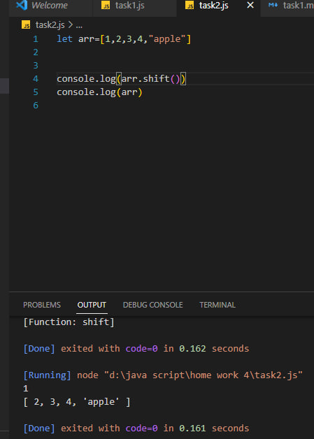

# array in java(массив в java script)
###
Объекты позволяют хранить данные со строковыми ключами. Это замечательно.

Но довольно часто мы понимаем, что нам необходима упорядоченная коллекция данных, в которой присутствуют 1-й, 2-й, 3-й элементы и т.д. Например, она понадобится нам для хранения списка чего-либо: пользователей, товаров, элементов HTML и т.д.

В этом случае использовать объект неудобно, так как он не предоставляет методов управления порядком элементов. Мы не можем вставить новое свойство «между» уже существующими. Объекты просто не предназначены для этих целей.

Для хранения упорядоченных коллекций существует особая структура данных, которая называется массив, Array.
###
Объявление
#####
Существует два варианта синтаксиса для создания пустого массива:

#

#####
Практически всегда используется первый вариант синтаксиса. В скобках мы можем указать начальные значения элементов:
#

#####
Элементы массива нумеруются, начиная с нуля.

Мы можем получить элемент, указав его номер в квадратных скобках:
#

##### 
Мы можем заменить элемент:
#

#####
…Или добавить новый к существующему массиву:
#

#####
Общее число элементов массива содержится в его свойстве length:
#

#####
Вывести массив целиком можно при помощи console.log
#

###
Методы pop/push, shift/unshift
#####
Очередь – один из самых распространённых вариантов применения массива. В области компьютерных наук так называется упорядоченная коллекция элементов, поддерживающая два вида операций:

push добавляет элемент в конец.
shift удаляет элемент в начале, сдвигая очередь, так что второй элемент становится первым.
#

#####
Массивы поддерживают обе операции.

На практике необходимость в этом возникает очень часто. Например, очередь сообщений, которые надо показать на экране.

Существует и другой вариант применения для массивов – структура данных, называемая стек.

Она поддерживает два вида операций:

push добавляет элемент в конец.
pop удаляет последний элемент.
Таким образом, новые элементы всегда добавляются или удаляются из «конца».

Примером стека обычно служит колода карт: новые карты кладутся наверх и берутся тоже сверху:

#

#####
Массивы в JavaScript могут работать и как очередь, и как стек. Мы можем добавлять/удалять элементы как в начало, так и в конец массива.

В компьютерных науках структура данных, делающая это возможным, называется двусторонняя очередь.

Методы, работающие с концом массива:

pop
Удаляет последний элемент из массива и возвращает его:
#

##### push
Добавляет элемент в конец массива:
#

#####
Методы, работающие с началом массива:

shift
Удаляет из массива первый элемент и возвращает его:
#

#####
unshift
Добавляет элемент в начало массива:
#

#####
Методы push и unshift могут добавлять сразу несколько элементов:
#

###
Метод (reverse) в массиве 
#####
Метод reverse() на месте обращает порядок следования элементов массива. Первый элемент массива становится последним, а последний — первым.
#

### 
метод concat()
#####
Метод concat() возвращает новый массив, состоящий из массива, на котором он был вызван, соединённого с другими массивами и/или значениями, переданными в качестве аргументов
#

###
Метод indexOf()
#####
 Метод indexOf() возвращает первый индекс, по которому данный элемент может быть найден в массиве или -1, если такого индекса нет.
#
 

###
метод includs()
#####
includes() возвращает логическое значение и позволяет определить, есть ли в массиве указанный элемент. Он выдает простой ответ true или false . Базовый синтаксис выглядит так: arr.
#

###
метод splice()
#####
Метод arr.splice(str) – это универсальный «швейцарский нож» для работы с массивами. Умеет всё: добавлять, удалять и заменять элементы. Он изменяет arr начиная с индекса start : удаляет deleteCount элементов и затем вставляет elem1, ..., elemN на их место. Возвращает массив из удалённых элементов.
#

###
метод slice()
#####
Метод slice() возвращает новый массив, содержащий элементы массива от элемента, заданного аргументом начало start, до элемента, определяемого аргументом конец end, но не включая его.
Если аргумент end не указан, возвращаемый массив содержит все элементы от элемента, заданного аргументом start, до конца массива.
#
 

### 
Методы массива JavaScript

### метод map()
#####
Метод map вызывает переданную функцию callback один раз для каждого элемента, в порядке их появления и конструирует новый массив из результатов её вызова. Функция callback вызывается только для индексов массива, имеющих присвоенные значения, включая undefined. Она не вызывается для пропущенных элементов массива (то есть для индексов, которые никогда не были заданы, которые были удалены или которым никогда не было присвоено значение.Если в метод map был передан параметр thisArg, при вызове callback он будет использоваться в качестве значения this. В противном случае в качестве значения this будет использоваться значение undefined. В конечном итоге, значение this, наблюдаемое из функции callback, определяется согласно обычным правилам определения this, видимого из функции.

Метод map не изменяет массив, для которого он был вызван (хотя функция callback может это делать).

Диапазон элементов, обрабатываемых методом map, устанавливается до первого вызова функции callback. Элементы, добавленные в массив после начала выполнения метода map, не будут посещены функцией callback. Если существующие элементы массива изменяются функцией callback, их значения, переданные в функцию, будут значениями на тот момент времени, когда метод map посетит их; удалённые элементы посещены не будут.

Примеры:
#

### Метод foreach()
#####
Описание
Метод forEach() выполняет функцию callback один раз для каждого элемента, находящегося в массиве в порядке возрастания. Она не будет вызвана для удалённых или пропущенных элементов массива. Однако, она будет вызвана для элементов, которые присутствуют в массиве и имеют значение undefined.

Функция callback будет вызвана с тремя аргументами:

значение элемента (value)
индекс элемента (index)
массив, по которому осуществляется проход (array)
Если в метод forEach() был передан параметр thisArg, при вызове callback он будет использоваться в качестве значения this. В противном случае, в качестве значения this будет использоваться значение undefined. В конечном итоге, значение this, наблюдаемое из функции callback, определяется согласно обычным правилам определения this, видимого из функции.

Диапазон элементов, обрабатываемых методом forEach(), устанавливается до первого вызова функции callback. Элементы, добавленные в массив после начала выполнения метода forEach(), не будут посещены функцией callback. Если существующие элементы массива изменятся, значения, переданные в функцию callback, будут значениями на тот момент времени, когда метод forEach() посетит их; удалённые элементы посещены не будут. Если уже посещённые элементы удаляются во время итерации (например, с помощью shift()), последующие элементы будут пропущены. 
Метод forEach ничего не возвращает, его используют только для перебора, как более «элегантный» вариант, чем обычный цикл for.

пример :

#

###
метод find()

Представьте, что у нас есть массив объектов. Как нам найти объект с определённым условием?

Здесь пригодится метод arr.find.
Синтаксис:
#

#
#####
Функция вызывается по очереди для каждого элемента массива:

item – очередной элемент.
index – его индекс.
array – сам массив.
Если функция возвращает true, поиск прерывается и возвращается item. Если ничего не найдено, возвращается undefined.
Например, у нас есть массив пользователей, каждый из которых имеет поля id и name. Найдем пользователя с id == 1:
#

#

### Метод sort()
#####
Вызов arr.sort() сортирует массив на месте, меняя в нём порядок элементов.

Он также возвращает отсортированный массив, но обычно возвращаемое значение игнорируется, так как изменяется сам arr.

Например:
#

###
Find the lowest value and highest value:
Найдите наименьшее значение и наибольшее значение:
метод который находит наименьшее и наибольшое значение 
метод работает посредством метода sort
#####
Пример :
#
